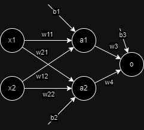

Première couche :

$a_1 = x_1w_{11} + x_2w_{12} + b_1$

$a_2 = x_1w_{21} + x_2w_{22} + b_2$

Notation matricielle:

$$
\begin{pmatrix}
a_1 & a_2
\end{pmatrix}
= \sigma(
\begin{pmatrix}
x_1 & x_2
\end{pmatrix}
\begin{pmatrix}
w_{11} & w_{12}\\
w_{21} & w_{22}
\end{pmatrix}
+
\begin{pmatrix}
b_1 & b_2
\end{pmatrix})
$$

Deuxième couche:

$ o = \sigma(a_1 * w_3 + a_2*w_4) $

Pour une couche i : $Y_i = \sigma(A_iW_i + B_i)$
